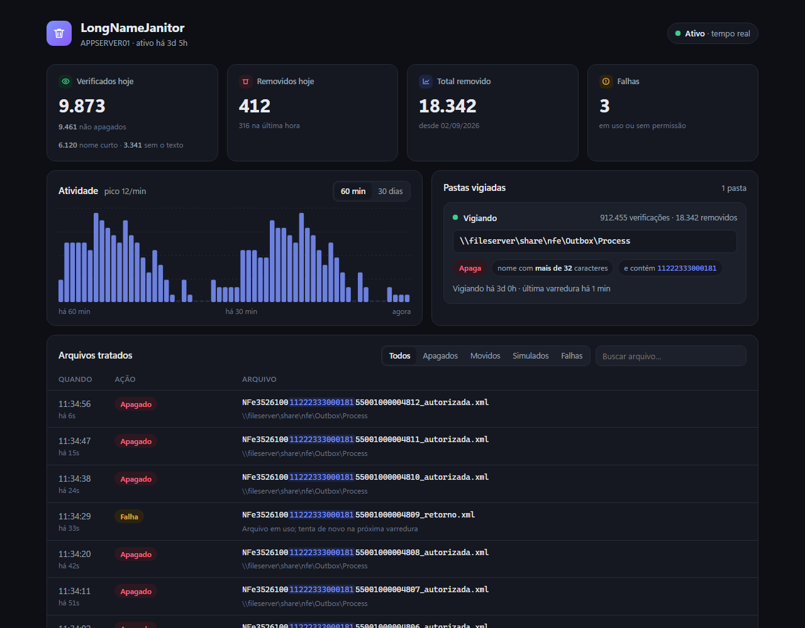

# LongNameJanitor

[](https://github.com/brunosiqp/LongNameJanitor/actions/workflows/build.yml)
[](https://github.com/brunosiqp/LongNameJanitor/releases/latest)


[](LICENSE)

**[English](#english) · [Português](#português)**



---

## English

A lightweight Windows service that watches folders (local or network shares) and **deletes or moves** files whose
name is longer than N characters and contains a given text (e.g. a company tax ID). It comes with a live web
dashboard.

- Reacts instantly (`FileSystemWatcher`), plus a full scan on startup and every `RescanMinutes`.
- Network share went away (server reboot, SMB, network)? Reconnects on its own, backing off from 5 s up to 5 min.
- File still being written (locked): retries for ~10 s; otherwise it counts as a failure and the next scan picks it up.
- **Persistent counters**: total, per day and the last 300 files in `data\stats.json`; nothing resets on restart.
- **History**: every handled file becomes a line in `data\historico\yyyy-MM-dd.csv` (opens in Excel).
- **Checked files**: every time a file is looked at (event or rescan) it is counted, together with why it was kept
  (name too short / missing the text), so you can see what passed through the folder and was not removed.
- **Dry run (safe mode)**: `"DryRun": true` removes nothing; the dashboard and the history show what *would* be removed.
- Idle cost is near zero: ~20 MB of RAM and no polling.

### Install on a server

1. Download `LongNameJanitor-win-x64.zip` from the [latest release](https://github.com/brunosiqp/LongNameJanitor/releases/latest)
   (or build it: `dotnet publish -c Release -o publish`). The .exe bundles the runtime: the server needs no .NET.
2. Unzip it on the server and run, in an **elevated PowerShell**:

   ```
   powershell -ExecutionPolicy Bypass -File .\install.ps1
   ```

   - Without an `appsettings.local.json`, the script copies the example to `C:\Tools\LongNameJanitor\`, opens it in
     Notepad and stops. Add your folders, save, and run `install.ps1` again.
   - It asks for the **service account**: use a domain account that can modify files in the network folder
     (the default service account cannot see network shares).
   - It grants "Log on as a service", creates the service (delayed auto start, restarts on failure), opens port
     5080 in the firewall, starts it and checks that every folder is reachable.
3. Open the dashboard at `http://<server>:5080`.

**Update:** run the same `install.ps1` from a newer package. It only replaces the .exe and restarts; the server's
configuration and counters are kept. **Remove:** `uninstall.ps1` (files and history stay).
Options: `.\install.ps1 -InstallDir D:\Apps\LongNameJanitor -Port 8080`.

### Configuration

- `appsettings.json`: general settings (dashboard port, rescan interval, logging).
- `appsettings.local.json`: **your folders and rules**. Not tracked by git; start from
  [appsettings.local.example.json](appsettings.local.example.json).

```json
{
  "Janitor": {
    "Folders": [
      {
        "Path": "\\\\fileserver\\share\\nfe\\Outbox\\Process",
        "Action": "Delete",
        "MaxNameLength": 32,
        "CountExtension": true,
        "NameContains": [ "11222333000181" ],
        "IncludeSubdirectories": false,
        "DryRun": true
      }
    ]
  }
}
```

A file is handled only when **both** rules match: the name is longer than `MaxNameLength` **and** it contains any of
the `NameContains` texts (anywhere in the name; an empty list matches every name).

| Field | Meaning |
|---|---|
| `Urls` | Dashboard address. `http://*:5080` accepts other machines. |
| `Janitor:RescanMinutes` | Safety rescan interval. |
| `Janitor:DataPath` | Where counters and history are saved (default: `data` next to the .exe). |
| `Path` | Watched folder. In JSON every `\` becomes `\\`. Always use `\\server\...`: services cannot see mapped drives (`Z:\`). |
| `Action` | `Delete` or `Move` (to `MoveTo`; name clashes get a `_yyyyMMdd_HHmmssfff` suffix). |
| `MaxNameLength` | Maximum name length. |
| `CountExtension` | `true` counts the extension (`report.pdf` = 10). |
| `NameContains` | Texts the name must contain (any one is enough). |
| `IncludeSubdirectories` | Also watch subfolders. |
| `DryRun` | `true` = dry run: nothing is deleted or moved, matches show up as "Simulado". `Janitor:DryRun` turns it on for every folder. The example starts in dry run on purpose. |

Add more blocks to `Folders` to watch more folders, then `Restart-Service LongNameJanitor`.
Logs go to Event Viewer > Application, source `LongNameJanitor`.

The dashboard is read-only and has no login: anyone who can reach the port sees file names. To restrict it, use
`"Urls": "http://localhost:5080"` or limit the firewall rule with `-RemoteAddress`.

### Run from the console

Running the .exe directly works the same way, logging to the screen (Ctrl+C to quit). Settings can be overridden
from the command line:

```
LongNameJanitor.exe --Janitor:Folders:0:Path="\\server\folder" --Janitor:Folders:0:Action=Move --Janitor:Folders:0:MoveTo="C:\quarantine"
```

---

## Português

Serviço leve do Windows que vigia pastas (locais ou de rede) e **apaga ou move** arquivos cujo nome passa de N
caracteres e contém um texto (ex.: um CNPJ). Tem um painel no navegador que atualiza ao vivo.

- Reage na hora (`FileSystemWatcher`) e também varre a pasta ao iniciar e a cada `RescanMinutes`.
- Pasta de rede caiu (servidor reiniciou, SMB, rede)? Reconecta sozinho, com espera crescente de 5 s até 5 min.
- Arquivo ainda sendo gravado (em uso): tenta por ~10 s; se não der, conta como falha e a próxima varredura pega.
- **Contagem salva**: total, por dia e últimos 300 arquivos em `data\stats.json`; não zera ao reiniciar.
- **Histórico**: cada arquivo tratado vira uma linha em `data\historico\aaaa-MM-dd.csv` (abre no Excel).
- **Verificados**: cada vez que um arquivo é olhado (evento ou varredura) ele é contado, junto com o motivo de ter
  ficado (nome curto / sem o texto). Assim dá para ver o que passou pela pasta e não foi apagado.
- **Modo simulação (seguro)**: com `"DryRun": true` nada é apagado; o painel e o histórico mostram o que *seria* apagado.
- Parado, quase não gasta nada: ~20 MB de memória e nenhuma varredura contínua.

### Instalar no servidor

1. Baixe o `LongNameJanitor-win-x64.zip` do [último release](https://github.com/brunosiqp/LongNameJanitor/releases/latest)
   (ou gere: `dotnet publish -c Release -o publish`). O .exe já leva o runtime: o servidor não precisa de .NET.
2. Descompacte no servidor e rode num **PowerShell como administrador**:

   ```
   powershell -ExecutionPolicy Bypass -File .\install.ps1
   ```

   - Sem `appsettings.local.json`, o script copia o exemplo para `C:\Tools\LongNameJanitor\`, abre no Bloco de
     Notas e para. Coloque suas pastas, salve e rode o `install.ps1` de novo.
   - Ele pede a **conta que roda o serviço**: uma conta de domínio com permissão de modificar arquivos na pasta
     de rede (a conta padrão de serviço não enxerga compartilhamentos).
   - Dá o direito "Fazer logon como serviço", cria o serviço (início automático atrasado, reinicia sozinho se
     cair), libera a porta 5080 no firewall, inicia e confere se cada pasta está acessível.
3. Abra o painel: `http://<servidor>:5080`.

**Atualizar:** rode o mesmo `install.ps1` de um pacote mais novo. Ele troca só o .exe e reinicia; a configuração
e a contagem do servidor ficam. **Remover:** `uninstall.ps1` (os arquivos e o histórico ficam).
Opções: `.\install.ps1 -InstallDir D:\Apps\LongNameJanitor -Port 8080`.

### Configuração

- `appsettings.json`: valores gerais (porta do painel, varredura, logs).
- `appsettings.local.json`: **suas pastas e regras**. Fica fora do git; parta do
  [appsettings.local.example.json](appsettings.local.example.json) (exemplo na seção em inglês acima).

Um arquivo só é tratado se **as duas** regras valem: nome com mais de `MaxNameLength` caracteres **e** contém
algum dos textos de `NameContains` (em qualquer posição; lista vazia = qualquer nome).

| Campo | O que faz |
|---|---|
| `Urls` | Endereço do painel. `http://*:5080` aceita acesso de outras máquinas. |
| `Janitor:RescanMinutes` | Intervalo da varredura de segurança. |
| `Janitor:DataPath` | Onde salvar contagem e histórico (padrão: `data` ao lado do .exe). |
| `Path` | Pasta vigiada. Em JSON cada `\` vira `\\`. Use sempre `\\servidor\...`: serviços não enxergam unidades mapeadas (`Z:\`). |
| `Action` | `Delete` (apaga) ou `Move` (move para `MoveTo`; nome repetido ganha `_aaaaMMdd_HHmmssfff`). |
| `MaxNameLength` | Tamanho máximo do nome. |
| `CountExtension` | `true` conta o nome com a extensão (`relatorio.pdf` = 13). |
| `NameContains` | Textos que o nome precisa conter (basta um). |
| `IncludeSubdirectories` | Vigia também as subpastas. |
| `DryRun` | `true` = simulação: nada é apagado nem movido; o que bateria na regra aparece como "Simulado". `Janitor:DryRun` liga para todas as pastas. O exemplo já começa em simulação, de propósito. |

Para vigiar mais pastas, adicione blocos em `Folders` e rode `Restart-Service LongNameJanitor`.
Logs: Visualizador de Eventos > Aplicativo, origem `LongNameJanitor`.

O painel é só leitura e não tem login: qualquer um que alcance a porta vê os nomes dos arquivos. Para restringir,
use `"Urls": "http://localhost:5080"` ou limite a regra de firewall com `-RemoteAddress`.

### Rodar no console

Rodando o .exe direto ele funciona igual, com o log na tela (Ctrl+C para sair). Dá para sobrescrever a
configuração pela linha de comando:

```
LongNameJanitor.exe --Janitor:Folders:0:Path="\\servidor\pasta" --Janitor:Folders:0:Action=Move --Janitor:Folders:0:MoveTo="C:\quarentena"
```

---

[MIT](LICENSE) © brunosiqp
